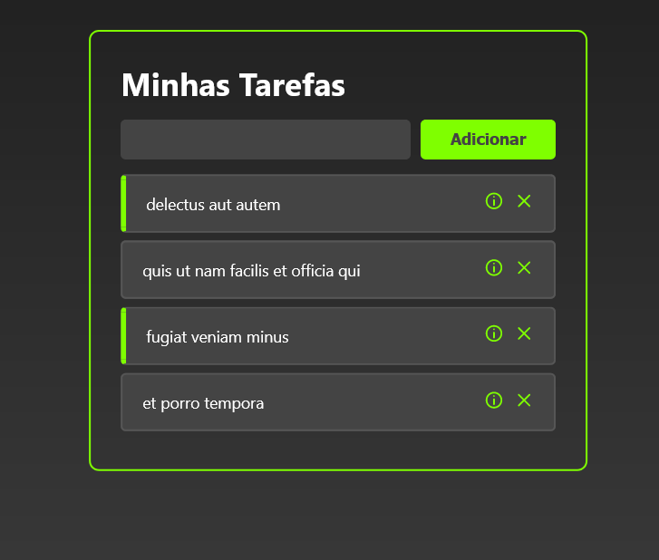

# To Do List com ReactJS

## Screenshot

## Sobre o projeto
Curso introdutório que fornece uma base ao aprendizado de ReactJS, através do desenvolvimento de uma lista de tarefas com detalhes atribuídos.

## Aprendizados
O que eu aprendi durante a construção do projeto:
- O que são componentes, e como torná-los reutilizáveis;
- O que são Hooks;
- States;
- Props;
- Páginas no React utilizando a biblioteca react-router-dom;
- API fake de tarefas;
- useEffect;
- Componentes funcionais vs componentes de classe;
- Keys em listas.